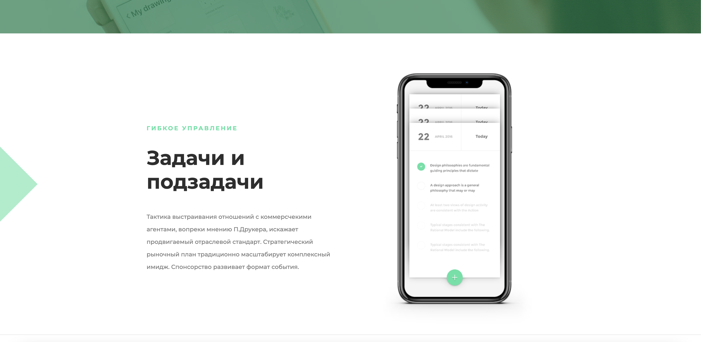
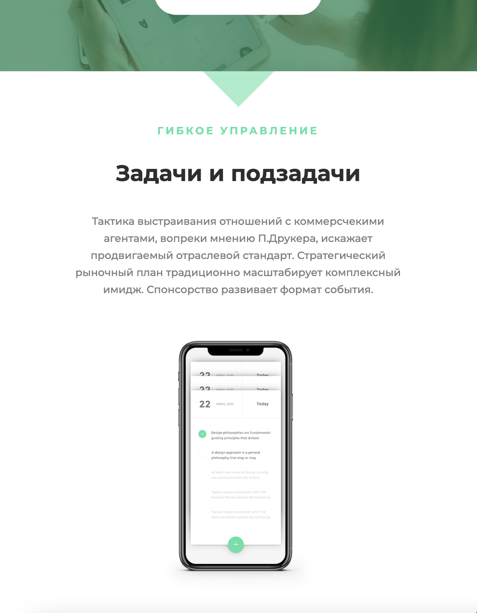

# Верстка макета проекта “ЮНИТ” 

## Что сделано:

* Сверстана посадочная страница (лэндинг) по psd макету (PixelPerfect подход)
* Использован flexbox
* Сделана мобильная адаптация по принципу mobile-firs
* Использован препроцессор LESS
* Добавлен JS скрипт (раздел с каруселью)

_desktop_

_tablet_

_desktop_

_tablet_

_mobile_

